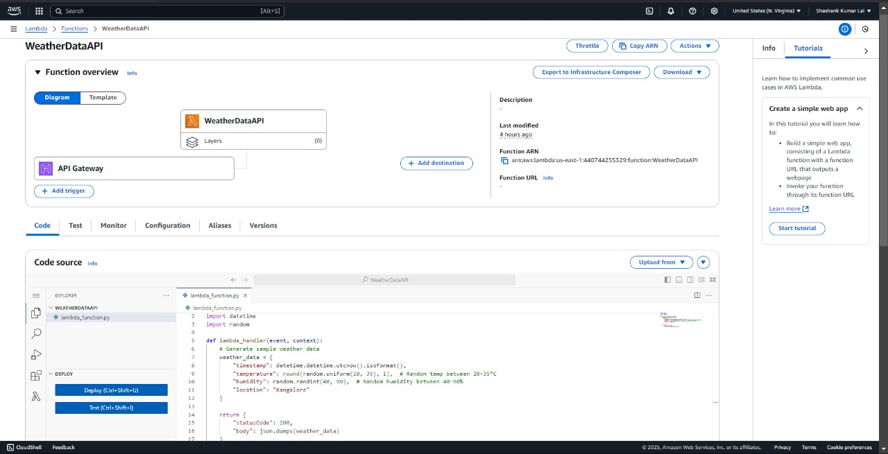

# Cloud-Integrated-Weather-Analytics-Pipeline

## **Project Overview 🌦️**
This project automates the collection, storage, and analysis of weather data using cloud services and R programming. The system fetches real-time weather data, processes it into JSON format, uploads it to an AWS S3 bucket, and then analyzes and visualizes the data in R using ggplot2 and Shiny.

## **Main Features 🔥**
- 🌍 **Automated Weather Data Collection** using APIs
- ☁️ **AWS Integration** (Lambda, S3, API Gateway)
- 📅 **Task Scheduling** with Windows Task Scheduler
- 📊 **Data Analysis & Visualization** with R (ggplot2, Shiny)

## **HOW the project solves a fundamental data analytics problem:**
✅ Real-time data collection – No need for manual data entry
✅ Automated cloud storage – Ensures scalability and availability
✅ Data-driven decision-making – Helps in weather trend analysis
✅ Seamless integration with R – Enables statistical and graphical analysis

## **📌 Real-world impact:**
Weather forecasting agencies can collect & analyze historical weather data.
Businesses (e.g., agriculture, aviation) can make climate-sensitive decisions.
Smart cities can track temperature & humidity changes for urban planning.
Research institutions can study climate change trends over time.


---

## **Project Workflow 🔄**

1. **Fetch Weather Data**: 
   - A Python script fetches real-time weather data from an API.
   - The data is formatted into structured JSON.

2. **Upload Data to AWS S3**: 
   - AWS Lambda function automatically uploads the JSON files to an S3 bucket.
   - API Gateway provides a RESTful interface for accessing the data.

3. **Automate Execution**: 
   - Windows Task Scheduler triggers the script at regular intervals to ensure continuous data collection.

4. **Analyze & Visualize in R**: 
   - R scripts process the stored weather data.
   - Data is visualized using `ggplot2` and `Shiny` dashboards.

---

## **Setup Guide 🚀**

### **1️⃣ AWS Configuration**
#### **1.1 Create an S3 Bucket**
- Go to AWS S3 and create a new bucket.
- Enable public access or set IAM policies accordingly.

#### **1.2 Set Up AWS Lambda**
- Create an AWS Lambda function.
- Upload the Python script to process and upload data.
- Set up a trigger for automatic execution.

#### **1.3 Configure API Gateway**
- Create a new API in API Gateway.
- Connect it to the Lambda function for data retrieval.
- Deploy the API and get the endpoint URL.

### **2️⃣ Automating Execution**
#### **2.1 Windows Task Scheduler Setup**
- Open Task Scheduler and create a new task.
- Set the trigger to run the script at scheduled intervals.
- Use `python script.py` in the action to execute it.

### **3️⃣ Data Analysis & Visualization in R**
#### **3.1 Load JSON Data in R**
```r
library(jsonlite)
weather_data <- fromJSON("data.json")
```
#### **3.2 Generate Visualizations**
```r
library(ggplot2)
ggplot(weather_data, aes(x = date, y = temperature)) + geom_line() + theme_minimal()
```
#### **3.3 Deploy a Shiny Dashboard**
- Use `shiny` to create an interactive dashboard.
- Visualize temperature trends, humidity levels, etc.

---

## **Screenshots 📸**
🖼️ *Include the following:*  
✅ AWS Lambda function setup 
 
✅ API Gateway configuration  

✅ Windows Task Scheduler execution logs  
 
✅ S3 bucket with stored JSON files  
 

---

## **Conclusion 🎯**
This project demonstrates an end-to-end cloud-integrated pipeline for weather data analytics. By leveraging AWS services and R programming, it enables real-time data collection, automated storage, and insightful visualization.

## **OUTPUT** 
{"timestamp":"2025-03-06T07:11:49.027049","temperature":20.9,"humidity":83,"location":"Bangalore"}

{"timestamp":"2025-03-06T07:11:49.027049","temperature":20.9,"humidity":83,"location":"Bangalore"}

{"timestamp":"2025-03-06T07:11:49.027049","temperature":20.9,"humidity":83,"location":"Bangalore"}


💡 *Future Enhancements:* 
- Add machine learning models for weather prediction.
- Extend support for multiple weather APIs.
- Deploy Shiny dashboard on a cloud server for public access.
